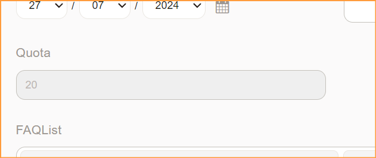

# Znuny-ReadOnly-Field
- Set input field as read-only if value existed.

1. Configuration at Admin > Frontend::Output::FilterContent###ReadOnlyField
2. Support ticket attributes e.g:

        DynamicField_XXX
        TypeID
        ServiceID
        SLAID

